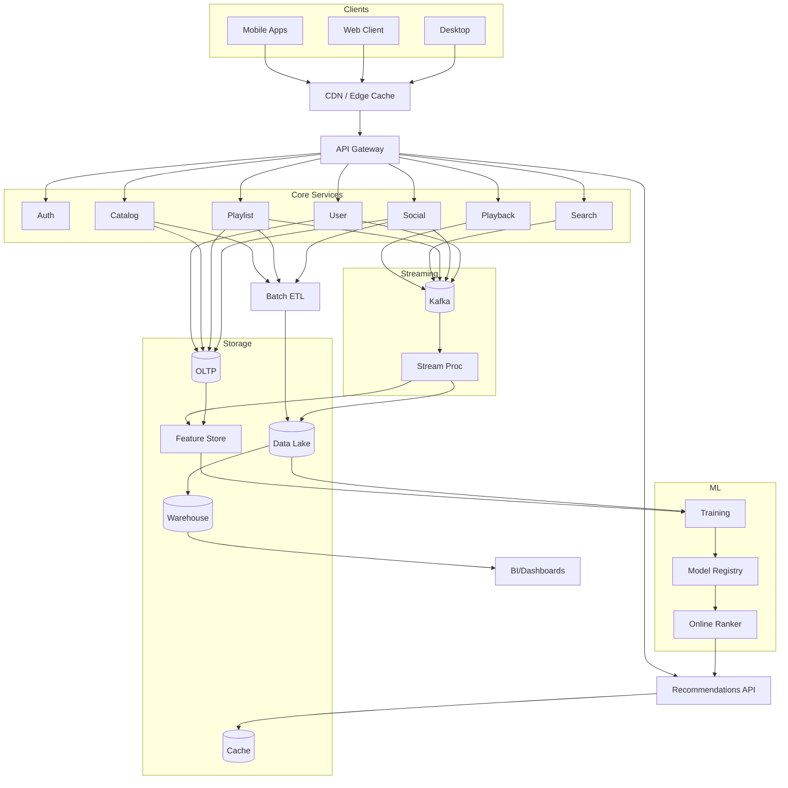

# System Architecture

This architecture implements an end-to-end pipeline from ETL to NLP feature extraction, mood-aware recommender, and reporting/dashboard.

```mermaid
flowchart LR
    subgraph Ingestion[ETL Ingestion]
        A[Spotify Metadata\nTracks, Playlists, Audio Features] -->|API/Export| B[Raw Zone]
        C[Lyrics Source\n(Genius or dataset)] --> B
        D[Social Sentiment\n(Reddit/Twitter aggregates)] --> B
    end

    subgraph Processing[Processing]
        B --> E[Clean & Normalize]
        E --> F[Entity Store\nSQLite/Postgres]
        F --> G[NLP: Sentiment & Emotion\nTransformers]
        F --> H[Feature Engineering\nContent/CF features]
        G --> I[Mood Features]
        H --> J[User/Item Representations]
    end

    subgraph Modeling[Recommender]
        J --> K[Baseline Recommender\n(CF / content-based)]
        I --> L[Mood Re-Ranker]
        K --> L
        L --> M[Recommendation API\n(Batch/Notebook)]
    end

    subgraph Reporting[Analytics & Dashboard]
        M --> N[Predictions Store]
        F --> O[BI Dataset]
        N --> O
        O --> P[Power BI Dashboard]
    end
```

## Realistic Spotify-style Platform Architecture
Embed the more complete reference diagram from `docs/diagrams/spotify_system.mmd` in supporting docs or render via Mermaid-compatible viewers.



## Mood-Aware Workflow
The mood-aware flow is also available as `docs/diagrams/mood_reco_workflow.mmd`.

```mermaid
flowchart LR
  SPOT[Spotify Metadata] --> RAW[Raw Zone]
  LYR[Lyrics Dataset] --> RAW
  SOC[Social Sentiment Aggregates] --> RAW
  RAW --> CLEAN[Clean & Normalize]
  CLEAN --> SQL[SQLite/Postgres]
  SQL --> NLP[Sentiment & Emotion\n(Transformers)]
  NLP --> MOOD[Track/Playlist Mood Features]
  SQL --> FEATS[Feature Engineering\n(Audio/Lyrics/Interactions)]
  FEATS --> REPRS[User/Item Representations]
  REPRS --> BASE[Baseline Recommender\n(CF/Content)]
  MOOD --> RERANK[Mood-Aware Re-Ranker]
  BASE --> RERANK
  RERANK --> PRED[Predictions Store]
  PRED --> DASH[Power BI Dashboard]
  RERANK --> NB[Batch Notebook/API]
```

## Components
- ETL: Batch ingestion of Spotify metadata, lyrics, and social aggregates into a raw zone; cleaning and normalization into `SQLite/Postgres`.
- NLP: Hugging Face transformers for sentiment/emotion classification on lyrics; aggregation to track and playlist mood features.
- Feature Engineering: Content features (audio, lyrics), interaction features, and CF-ready matrices.
- Recommender: Baseline CF/content model; mood-aware re-ranking that conditions on current mood features.
- Serving/Analysis: Batch notebooks or lightweight API for inference; results stored for reporting.
- Dashboard: Power BI for mood segments, recommendation quality, and KPIs.

## Storage
- Raw data: `data/` (gitignored)
- Processed tables: `SQLite/Postgres` via SQLAlchemy
- Artifacts: `models/`, `outputs/`, `reports/` (gitignored)

## Orchestration
- Phase 1 uses scripts and notebooks; migrate to lightweight orchestration later if needed.
