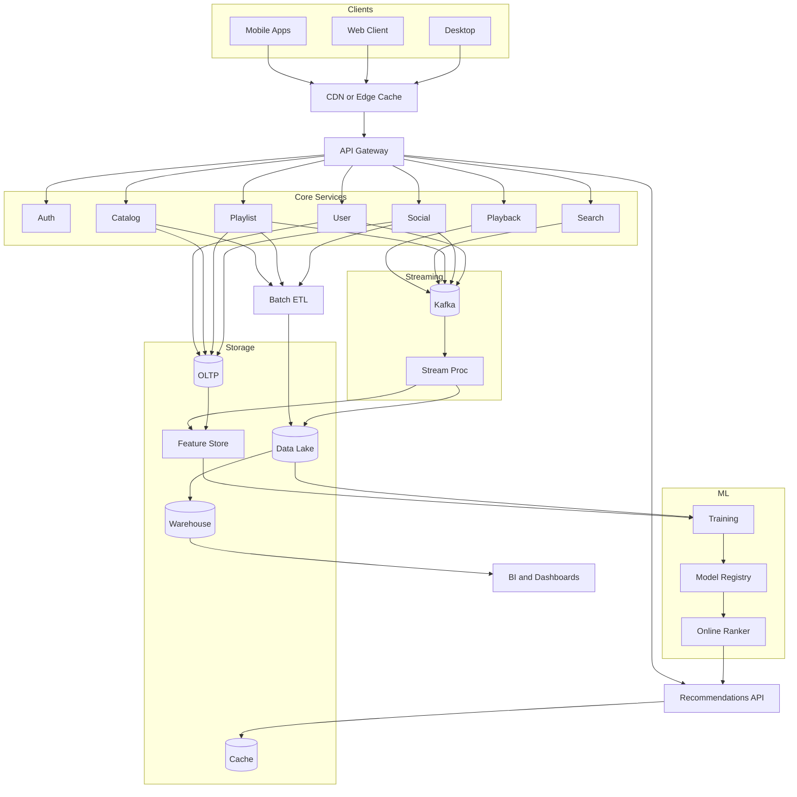
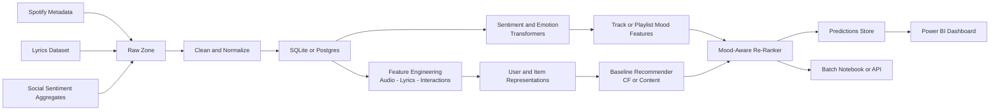

# System Architecture

This architecture implements an end-to-end pipeline from ETL to NLP feature extraction, mood-aware recommender, and reporting/dashboard.

```mermaid
flowchart LR
    subgraph Ingestion[ETL Ingestion]
        A[Spotify Metadata<br/>Tracks, Playlists, Audio Features] -->|API/Export| B[Raw Zone]
        C[Lyrics Source<br/>(Genius or dataset)] --> B
        D[Social Sentiment<br/>(Reddit or similar aggregates)] --> B
    end

    subgraph Processing[Processing]
        B --> E[Clean and Normalize]
        E --> F[Entity Store<br/>SQLite or Postgres]
        F --> G[NLP: Sentiment and Emotion<br/>Transformers]
        F --> H[Feature Engineering<br/>Content and CF features]
        G --> I[Mood Features]
        H --> J[User and Item Representations]
    end

    subgraph Modeling[Recommender]
        J --> K[Baseline Recommender<br/>(CF or content-based)]
        I --> L[Mood Re-Ranker]
        K --> L
        L --> M[Recommendation API<br/>(Batch or Notebook)]
    end

    subgraph Reporting[Analytics and Dashboard]
        M --> N[Predictions Store]
        F --> O[BI Dataset]
        N --> O
        O --> P[Power BI Dashboard]
    end
```

## Realistic Spotify-style Platform Architecture
Embed the more complete reference diagram from `docs/diagrams/spotify_system.mmd` in supporting docs or render via Mermaid-compatible viewers.



## Mood-Aware Workflow
The mood-aware flow is also available as `docs/diagrams/mood_reco_workflow.mmd`.



## Images (rendered by CI)
- Spotify-style platform (PNG): `docs/diagrams/img/spotify_system.png`
- Mood-aware workflow (PNG): `docs/diagrams/img/mood_reco_workflow.png`

## Components
- ETL: Batch ingestion of Spotify metadata, lyrics, and social aggregates into a raw zone; cleaning and normalization into `SQLite/Postgres`.
- NLP: Hugging Face transformers for sentiment/emotion classification on lyrics; aggregation to track and playlist mood features.
- Feature Engineering: Content features (audio, lyrics), interaction features, and CF-ready matrices.
- Recommender: Baseline CF/content model; mood-aware re-ranking that conditions on current mood features.
- Serving/Analysis: Batch notebooks or lightweight API for inference; results stored for reporting.
- Dashboard: Power BI for mood segments, recommendation quality, and KPIs.

## Storage
- Raw data: `data/` (gitignored)
- Processed tables: `SQLite/Postgres` via SQLAlchemy
- Artifacts: `models/`, `outputs/`, `reports/` (gitignored)

## Orchestration
- Phase 1 uses scripts and notebooks; migrate to lightweight orchestration later if needed.
