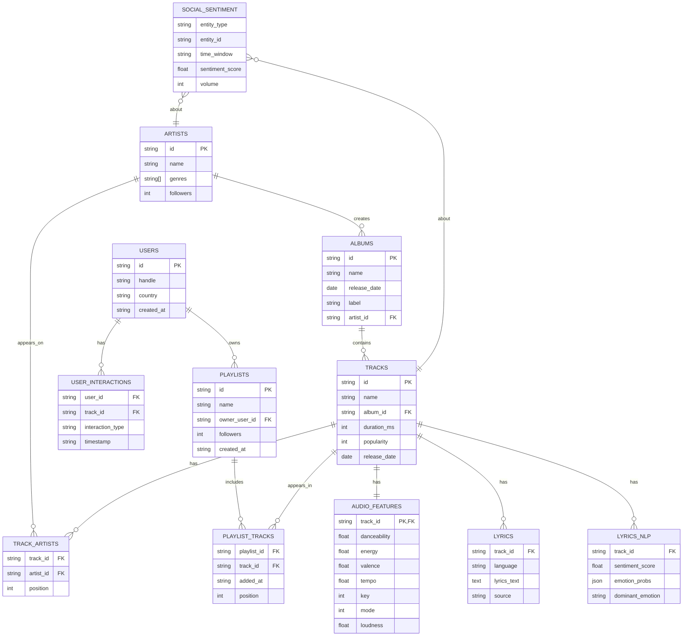
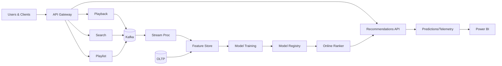

# ER Diagram and Workflow (Spotify-style)

## Entity-Relationship Diagram
The ERD models Spotify-like entities (users, artists, albums, tracks, playlists) and project-specific tables (lyrics, NLP outputs, social sentiment, interactions).

PNG (rendered by CI): `docs/diagrams/img/spotify_erd.png`

## Workflow (Spotify-style)

PNG (rendered by CI): `docs/diagrams/img/spotify_workflow.png`
